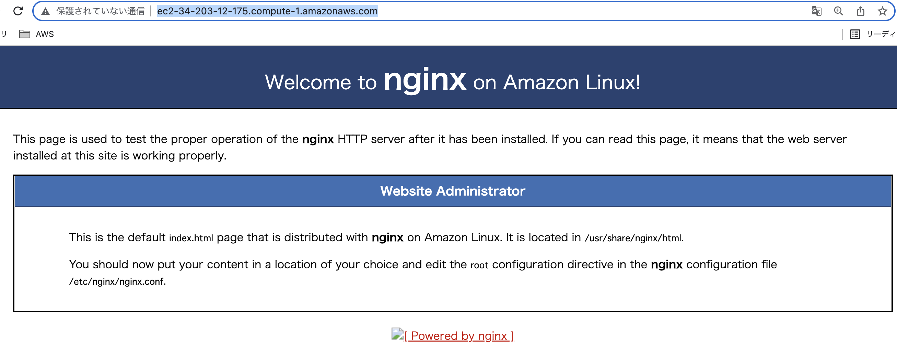
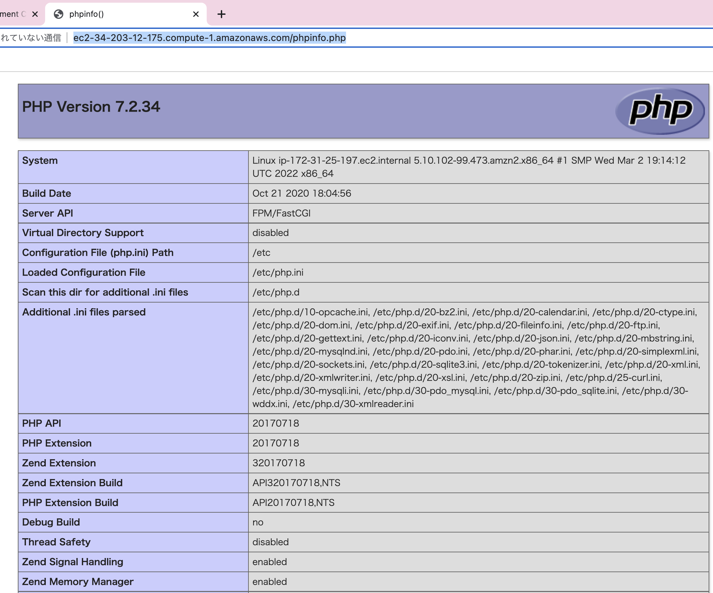

# aws-ec2-linux-config-nginx-demo 🐳


[](https://github.com/tquangdo/aws-ec2-linux-config-nginx-demo/issues/new)

## 1/ launch EC2
- type=`Linux`
- SG Inbound=`http(80) - all IPv4`

## 2/ install
1. ### nginx
    ```shell
    ec2-user$ sudo su -
    root$ amazon-linux-extras install nginx1.12 -y
    nginx -V
    # nginx version: nginx/1.12.2
    # ...TLS SNI support enabled
    systemctl start nginx.service
    systemctl status nginx.service # active
    ```
    - access EC2's DNS on browser
    
1. ### php
    ```shell
    amazon-linux-extras install php7.2 -y
    yum list php* | grep amzn2extra-php7.2
    yum install php php-devel php-opcache php-mbstring php-xml -y
    systemctl start php-fpm.service
    systemctl status php-fpm.service # active
    ```

## 3/ config
```shell
vim /etc/php-fpm.d/www.conf 
cat /etc/php-fpm.d/www.conf | grep "= nginx"
# user = nginx
# group = nginx
systemctl restart php-fpm.service
service nginx restart
service nginx status # active
```

## 4/ run test
- `echo '<?php phpinfo(); ?>' > /usr/share/nginx/html/phpinfo.php`
- access `DNS/phpinfo.php` on browser


