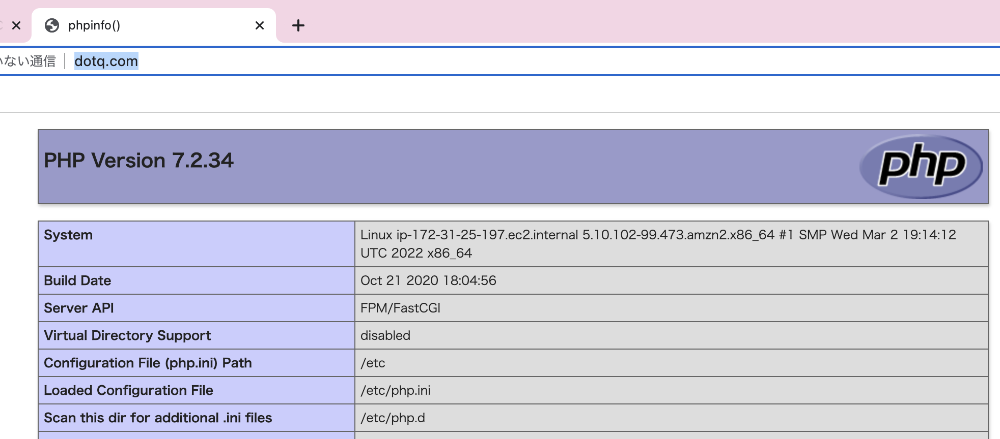

# aws-ec2-linux-config-nginx-demo 🐳


[](https://github.com/tquangdo/aws-ec2-linux-config-nginx-demo/issues/new)

## reference


## 1/ launch EC2
- type=`Linux`
- SG Inbound=`http(80) - all IPv4`

## 2/ install
1. ### nginx
    ```shell
    ec2-user$ sudo su -
    root$ amazon-linux-extras install nginx1.12 -y
    nginx -V
    # nginx version: nginx/1.12.2
    # ...TLS SNI support enabled
    systemctl start nginx.service
    systemctl status nginx.service # active
    ```
    - access EC2's DNS on browser
    
1. ### php
    ```shell
    amazon-linux-extras install php7.2 -y
    yum list php* | grep amzn2extra-php7.2
    yum install php php-devel php-opcache php-mbstring php-xml -y
    systemctl start php-fpm.service
    systemctl status php-fpm.service # active
    ```

## 3/ config
```shell
vim /etc/php-fpm.d/www.conf 
cat /etc/php-fpm.d/www.conf | grep "= nginx"
# user = nginx
# group = nginx
systemctl restart php-fpm.service
service nginx restart
service nginx status # active
```

## 4/ run test
- `echo '<?php phpinfo(); ?>' > /usr/share/nginx/html/phpinfo.php`
- access `DNS/phpinfo.php` on browser


## 5/ virtual host
1. ### hosts
    - CMD on local(Mac)!!!
    ```shell
    sudo vim /etc/hosts
    cat /etc/hosts | grep dotq.com
    # 34.203.12.175 dotq.com
    ```
    - access `dotq.com` on browser
    
1. ### create .conf file
    - `vim /etc/nginx/conf.d/dotq.com.conf` -> content in `nginx/dotq.com.conf`
    ```shell
    mkdir -p /var/www/dotq.com
    echo '<?php phpinfo(); ?>' > /var/www/dotq.com/index.php
    cat /var/www/dotq.com/index.php
    # <?php phpinfo(); ?>
    service nginx restart
    ```
    - access `dotq.com` on browser
    
1. ### check log
    ```shell
    tail /var/log/nginx/dotq.com.access.log 
    # 58.159.16.244 - - [17/Mar/2022:16:43:25 +0000] "GET / HTTP/1.1" 200 86424 "-" "Mozilla/5.0 (Macintosh; Intel Mac OS X 10_15_7) AppleWebKit/537.36 (KHTML, like Gecko) Chrome/99.0.4844.51 Safari/537.36" "-"
    # 58.159.16.244 - - [17/Mar/2022:16:43:26 +0000] "GET /favicon.ico HTTP/1.1" 404 571 "http://dotq.com/" "Mozilla/5.0 (Macintosh; Intel Mac OS X 10_15_7) AppleWebKit/537.36 (KHTML, like Gecko) Chrome/99.0.4844.51 Safari/537.36" "-"
    tail /var/log/nginx/dotq.com.error.log 
    # 2022/03/17 16:43:26 [error] 1064#0: *1 open() "/var/www/dotq.com/favicon.ico" failed (2: No such file or directory), client: 58.159.16.244, server: dotq.com, request: "GET /favicon.ico HTTP/1.1", host: "dotq.com", referrer: "http://dotq.com/"
    ```
1. ### test another php file
    - `vim /var/www/dotq.com/test.php` -> content in `nginx/test.php`
    - access `dotq.com/test.php` on browser
    